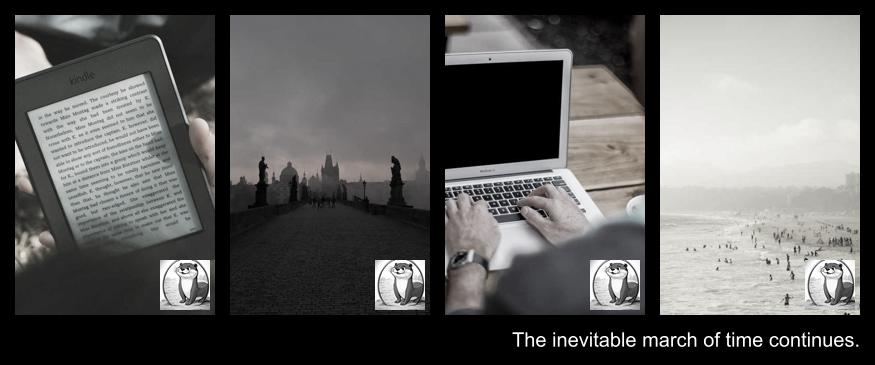
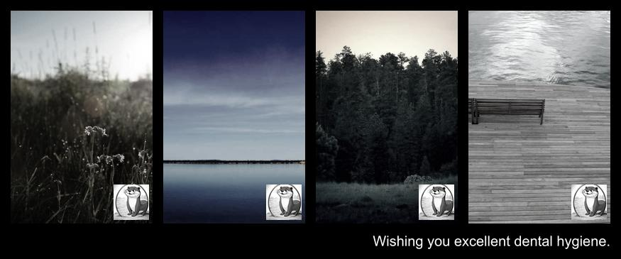
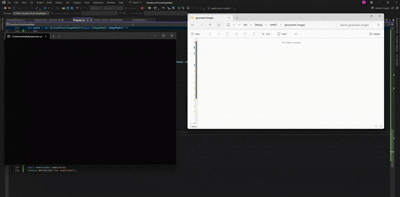

## Phtot Strips Maker (using TPL Dataflow)

Create TPL Dataflow pipeline for creating simple photo strips. The whole process looks like:

1. Download a random image with random dimensions
    - To get 600x800 image use URL: https://picsum.photos/600/800
2. Resize image to a standard size: 200x300
3. Darken image
4. Add predefined logo
    
    
5. Create photo strip from the specified photo batch
6. Add greeting text in the bottom of the above strip

`SixLabors.ImageSharp` package was used for image manipulation

### Results

